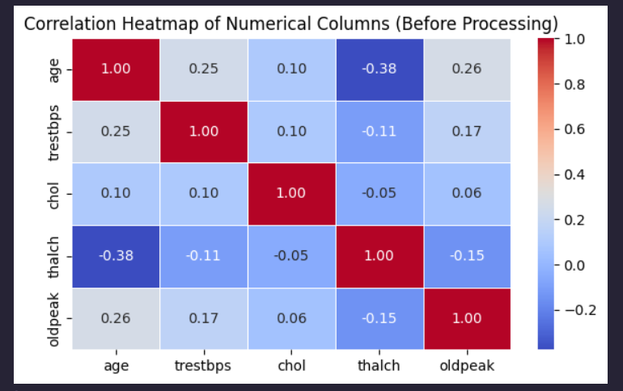
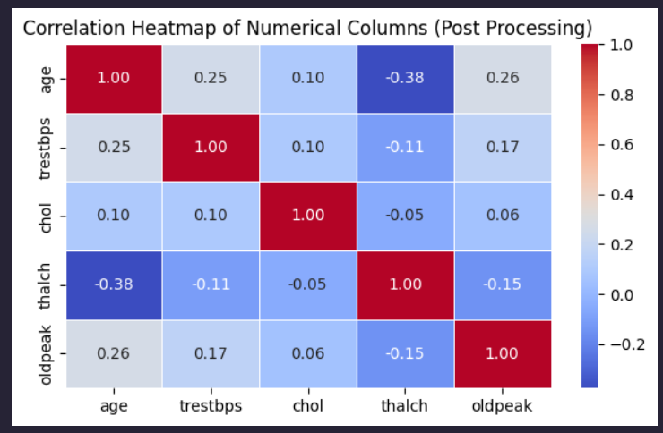

# Heart Disease Classification: Cleveland Heart Disease Dataset

## 📋 Project Overview
This project evaluates the predictive capability of machine learning models in diagnosing heart disease using the **Cleveland Heart Disease dataset**.

The primary objective was to establish a baseline using a **Logistic Regression** pipeline and benchmark it against a non-linear **Random Forest Classifier**. While the linear model offers interpretability, the comparative analysis reveals critical limitations in its ability to capture complex biological interactions, specifically regarding patient safety and error rates.

## 📊 Key Results & Performance Analysis
While the accuracy gap between the models appears marginal (~1.6%), a deeper look at the **Recall** (Sensitivity) reveals the risks associated with the simpler linear approach.

| Model | Accuracy | F1-Score (Macro) | Recall (Positive Class) | False Negative Rate |
| :--- | :--- | :--- | :--- | :--- |
| **Logistic Regression** | **82.07%** | **0.82** | **0.82** | **~18%** |
| Random Forest (Benchmark) | 83.70% | 0.83 | 0.83 | ~17% |

### ⚠️ Critical Analysis: The "False Negative" Problem
In medical diagnostics, **False Negatives (Type II Errors)**—predicting a patient is healthy when they actually have heart disease—are the most dangerous error type.

* **The Risk:** The Logistic Regression model has a recall of **0.82**, meaning it **misses roughly 18% of positive heart disease cases**.
* **Clinical Implication:** These 18% of patients would be sent home without treatment, potentially leading to severe cardiac events.
* **Linear Limitation:** The inability of Logistic Regression to outperform the Random Forest suggests that the decision boundary between "Healthy" and "Heart Disease" is not strictly linear. There are likely complex, non-linear interactions (e.g., specific combinations of *Age*, *Thalach*, and *Cholesterol*) that the linear model cannot capture.

---

## 🛠️ Data Preprocessing Pipeline
A rigorous preprocessing strategy was implemented to structure the data, though the linear constraints of the primary model limited the effectiveness of these features.

### 1. Imputation Strategy
* **Mode Imputation:** Used for categorical features (`fbs`, `restecg`, `exang`, `slope`).
* **KNN Imputation:** Applied to `chol` for distance-based estimation.
* **Target-Based KNN:** Applied to `ca` and `thal`. *Note: While this preserves signal, it introduces a risk of data leakage if not strictly contained within cross-validation folds.*

### 2. Feature Engineering
* **Scaling:** **Min/Max Scaling** ([0, 1]) was applied. *Critique: While necessary for Logistic Regression convergence, this scaling can suppress the impact of outliers in features like `cholesterol` which might be clinically significant.*
* **Encoding:** Standard Label and One-Hot encoding were utilized.

---

## 🔍 Exploratory Data Analysis
Correlation matrices illustrate the linear relationships captured by the model. However, the moderate correlation values suggest that single-feature linearity is weak, further explaining why the Logistic Regression model struggles to break the 85% accuracy ceiling.

| Raw Data Correlation | Processed Data Correlation |
| :---: | :---: |
|  |  |

---

## 🚀 Conclusion & Recommendations

While **Logistic Regression** provides a lightweight and interpretable baseline, it is **not sufficient for clinical deployment** due to its high False Negative rate (18%). The benchmark Random Forest model demonstrates that capturing non-linear feature interactions is essential for improving sensitivity.

### Path to Improvement
1. **Threshold Tuning:** Lower the decision threshold (e.g., to `0.3`) to prioritize **Recall**. This minimizes dangerous False Negatives at the cost of higher False Positives.
2. **Feature Engineering:** Introduce **interaction terms** and **binning** (e.g., Age groups) to capture non-linear relationships missing in the current model.
3. **Model Selection:** Transition to **Gradient Boosting (XGBoost)** or Stacking Ensembles to achieve a better sensitivity trade-off than standard Random Forests.

---

## 💻 Usage

```bash
git clone https://github.com/yourusername/heart-disease-analysis.git
pip install pandas numpy scikit-learn seaborn matplotlib
jupyter notebook "main (2).ipynb"
